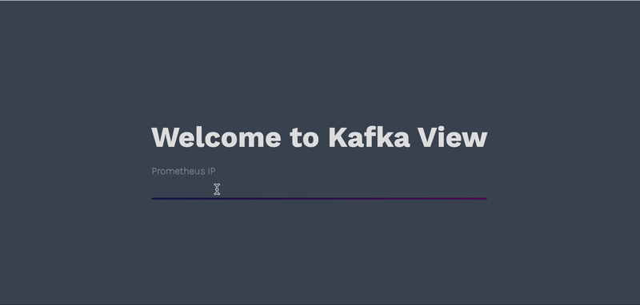
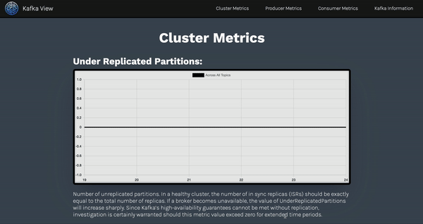
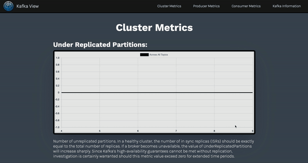

# KafkaView - Kafka Visualizer and Data Monitoring Tool

<div align="center">

  

</div>

## About

<div align='center'>


</div>

KafkaView is an open-source solution for monitoring your Kafka clusters. View metrics and information with just the broker IP address! Try it out for yourself or take a look at our *demo*  here. *demo-link-to-lp-here*

## Table of Contents

- [KafkaView - Kafka Visualizer and Data Monitoring Tool](#kafkaview---kafka-visualizer-and-data-monitoring-tool)
  - [About](#about)
  - [Table of Contents](#table-of-contents)
  - [Description](#description)
  - [Installation](#installation)
  - [Contact](#contact)
  - [License](#license)

## Description

Kafka is one of the most powerful and widely used event streaming platforms, however the flow of data is widely misunderstood. The Kafka ecosystem is hard to understand and Kafka lacks a UI for monitoring. Onboarding is a problem to do its complexity.

KafkaView provides real-time graphs displaying useful metrics for monitoring clusters, such as the rate at which producers send data to brokers, the total number of messages in each topic, etc. Visualize your Kafka metrics and simplify the structure of your Kafka projects. For beginners, KafkaView provides an information page to show users how a kafka ecosystem is set up along with descriptions of each part. 

## Installation


1. Decide where to clone this repository and type the following into terminal:

```
git clone https://github.com/oslabs-beta/KafkaView.git
```

2. Now type the following into your terminal:

- **npm install**

  Then type the following command:
- **npm start**

> [!NOTE]
> We should get a successful message saying the server is running on port 8080. If encountering an issue here, check if you typed 'npm install' or verify your current repository is correct. Open the server up on [localhost:8080](locahost:8080) if it doesn't already do so.


1. Add your Prometheus server by typing in the ip address and exposed port.

<br/>


<br/>

> [!NOTE]
> If you would like to use our demo Prometheus server, open kafka-metrics folder and follow steps in the Readme.txt to run our pre-configured kafka cluster.

2. Congrats! You can now view metrics! Various metrics, such as real-time updates on under replicated partitions and total messages being sent, are available on the first page. You can navigate to other metrics by clicking the link at the top of the page.
  
<br/>


<br/>


3. If you would like to learn more about the kafka ecosystem, click on the Kafka Information page. Enjoy!
   
<br/>


## Contact

<table>
  <tr>
    <td align="center">
      
      <br />
      <strong>Byrce Kelly</strong>
      <br />
      <a href="https://github.com/BryceK2">
        
      </a>
      <br />
      <a href="https://www.linkedin.com/in/-brycekelly/">
        
      </a>
    </td>
     <td align="center">
      
      <br />
      <strong>Chris Johnson</strong>
      <br />
      <a href="https://github.com/Johnson-Chris00">
        
      </a>
      <br />
      <a href="https://www.linkedin.com/in/johnson-chris00">
        
      </a>
    </td> <td align="center">
      
      <br />
      <strong>Joseph Defesh</strong>
      <br />
      <a href="https://github.com/JosephDafesh">
        
      </a>
      <br />
      <a href="https://www.linkedin.com/">
        
      </a>
    </td> <td align="center">
      
      <br />
      <strong>Sean Nguyen</strong>
      <br />
      <a href="https://github.com/seannguyen96">
        
      </a>
      <br />
      <a href="https://www.linkedin.com/in/sean-nguyen-cpslo/">
       
      </a>
      </form>
    </td>
  </tr>
</table>

## License
By contributing, you are agreeing that your contributions will be licensed under the [MIT License](/LICENSE).